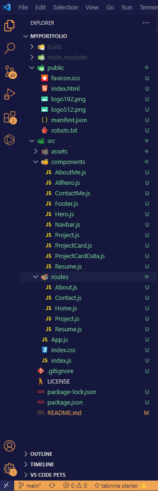

# MyPortfolio

[](https://badge.fury.io/gh/MyPortfolio%2FMyPortfolio)
[](https://coveralls.io/github/Ash0422/18-Social-Network-API?branch=master)

## Table of Contents

- [Description](#description)
- [Screenshots](#screenshots)
- [Installation](#installation)
- [Usage and DEMO](#usage-and-demogit)
- [User Story](#user-story)
- [Acceptance Criteria](#acceptance-criteria)
- [Contributing](#contributing)
- [Tests](#tests)
- [Credits](#credits)
- [Questions](#questions)

## Description

A portfolio is a curated collection of a person's work samples and achievements, showcasing their skills and expertise in a specific field. 
It helps professionals, such as designers, developers, and artists, to stand out and secure job opportunities or freelance projects.
A well-structured portfolio typically includes an introduction, work samples, and contact information.

## Screenshots
## Folder Structure <br>



## Screenshot of the Portfolio


## The following image shows  I have entered an invalid email address:

## The following image shows a link to a downloadable resume and a list of the developer’s proficiencies

## The following image shows a notification that this field is required 


## The following image shows the application's been deployed:

## Installation
you can : 
go to this link: https://my-portfolio-ash.herokuapp.com/
and check my Portfolio  

## Usage

A portfolio is used to showcase skills, establish credibility, attract job opportunities, track personal growth, and network with other professionals in the industry.


## User Story
```
AS AN employer looking for candidates with experience building single-page applications
I WANT to view a potential employee's deployed React portfolio of work samples
SO THAT I can assess whether they're a good candidate for an open position
```
## Acceptance Criteria
```
GIVEN a single-page application portfolio for a web developer
WHEN I load the portfolio
THEN I am presented with a page containing a header, a section for content, and a footer
WHEN I view the header
THEN I am presented with the developer's name and navigation with titles corresponding to different sections of the portfolio
WHEN I view the navigation titles
THEN I am presented with the titles About Me, Portfolio, Contact, and Resume, and the title corresponding to the current section is highlighted
WHEN I click on a navigation title
THEN I am presented with the corresponding section below the navigation without the page reloading and that title is highlighted
WHEN I load the portfolio the first time
THEN the About Me title and section are selected by default
WHEN I am presented with the About Me section
THEN I see a recent photo or avatar of the developer and a short bio about them
WHEN I am presented with the Portfolio section
THEN I see titled images of six of the developer’s applications with links to both the deployed applications and the corresponding GitHub repository
WHEN I am presented with the Contact section
THEN I see a contact form with fields for a name, an email address, and a message
WHEN I move my cursor out of one of the form fields without entering text
THEN I receive a notification that this field is required
WHEN I enter text into the email address field
THEN I receive a notification if I have entered an invalid email address
WHEN I am presented with the Resume section
THEN I see a link to a downloadable resume and a list of the developer’s proficiencies
WHEN I view the footer
THEN I am presented with text or icon links to the developer’s GitHub and LinkedIn profiles, and their profile on a third platform (Stack Overflow, Twitter) 
```
## Contributing
Pull requests are welcome, please open an issue first to discuss what you would like to change. thank you

## Tests
This Portfolio has been tested by the creator and it works fine.<br>
this application has been uploaded to github: https://github.com/Ash0422/MyPortfolio <br>
this application has been deployed to github: https://my-portfolio-ash.herokuapp.com/

## Credits
- https://www.w3schools.com/react/react_router.asp
- https://www.w3schools.com/react/react_css_styling.asp
- Our class record. 

## Questions
For any additional questions, please contact me at chibane.tkd04@gmail.com or visit my GitHub profile at https://github.com/Ash0422.

